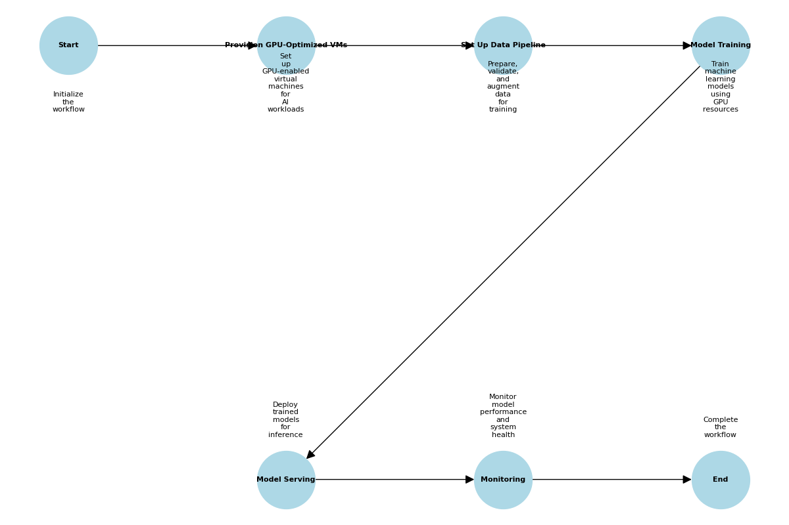

# Version 1: Full Control and Customization

This folder contains Bicep templates and related files for deploying an end-to-end ML and LLM platform with full control and customization. Each file corresponds to a specific component of the platform.

## Overview

Version 1 provides a highly customizable and controlled environment for deploying ML and LLM platforms. It leverages Azure Bicep templates to provision and manage resources, ensuring flexibility and scalability.

## Files and Their Purpose

1. **create_workflow_diagram.ipynb**
   - A Jupyter Notebook to visualize the workflow diagram for Version 1.

2. **gpu_vm.bicep**
   - Provisions GPU-optimized virtual machines (VMs) for running AI workloads.
   - Includes secure configurations and autoscaling options.

3. **data_pipeline.bicep**
   - Sets up data preparation, validation, and augmentation pipelines.
   - Provisions Azure Storage and Data Factory resources.

4. **model_training.bicep**
   - Creates an Azure Machine Learning workspace and GPU-enabled compute cluster for model development.

5. **model_serving.bicep**
   - Deploys an Azure Kubernetes Service (AKS) cluster and inference server for model serving and inference.

6. **monitoring.bicep**
   - Configures monitoring and observability using Azure Monitor and Log Analytics.

7. **workflow_diagram_adjusted_annotations.png**
   - A visual representation of the workflow for Version 1.

## Workflow Diagram

The workflow diagram provides a visual representation of the steps involved in deploying and managing the ML and LLM platform in Version 1. It illustrates the sequence of operations and their relationships, helping users understand the overall process.



### Steps in the Workflow

1. **Start**: The workflow begins with initializing the deployment process.
2. **Provision GPU-Optimized VMs**: Set up GPU-enabled virtual machines for running AI workloads.
3. **Set Up Data Pipeline**: Prepare, validate, and augment data for training using Azure Storage and Data Factory.
4. **Model Training**: Train machine learning models using GPU resources in an Azure Machine Learning workspace.
5. **Model Serving**: Deploy trained models for inference using an Azure Kubernetes Service (AKS) cluster.
6. **Monitoring**: Monitor model performance and system health using Azure Monitor and Log Analytics.
7. **End**: The workflow concludes after all components are deployed and operational.

The diagram file `workflow_diagram_adjusted_annotations.png` is located in this folder and can be used as a reference for understanding the deployment process.

## How to Use These Files

1. **Prerequisites**:
   - Ensure you have the Azure CLI installed and authenticated.
   - Install the Bicep CLI or use Azure CLI with Bicep support.

2. **Deployment Steps**:
   - Navigate to the `version1` folder.
   - Deploy each Bicep file using the following command:
     ```bash
     az deployment group create --resource-group <RESOURCE_GROUP> --template-file <FILE_NAME>
     ```
   - Replace `<RESOURCE_GROUP>` with your Azure resource group name and `<FILE_NAME>` with the name of the Bicep file.

3. **Order of Deployment**:
   - Deploy `gpu_vm.bicep` first to set up the infrastructure.
   - Deploy `data_pipeline.bicep` for data preparation.
   - Deploy `model_training.bicep` for model development.
   - Deploy `model_serving.bicep` for model serving.
   - Deploy `monitoring.bicep` for monitoring and observability.

## Additional Information

- **Security**: All templates follow Azure best practices for security, including encryption and role-based access control (RBAC).
- **Customization**: Modify the parameters in each Bicep file to suit your specific requirements.
- **Support**: For issues or questions, refer to the main repository's documentation or contact the maintainer.

## Known Issues

1. **data_pipeline.bicep**:
   - The resource type `Microsoft.DataFactory/factories@2022-09-01` does not have types available for validation in Bicep. Ensure all properties are correctly defined before deployment.

2. **model_training.bicep**:
   - The resource types `Microsoft.MachineLearningServices/workspaces@2022-09-01` and `Microsoft.MachineLearningServices/workspaces/computes@2022-09-01` do not have types available for validation in Bicep. Ensure all properties are correctly defined before deployment.

3. **monitoring.bicep**:
   - The resource types `Microsoft.OperationalInsights/workspaces@2022-09-01` and `Microsoft.Insights/components@2022-09-01` do not have types available for validation in Bicep. Ensure all properties are correctly defined before deployment.

## License

This project is licensed under the MIT License. See the LICENSE file for details.