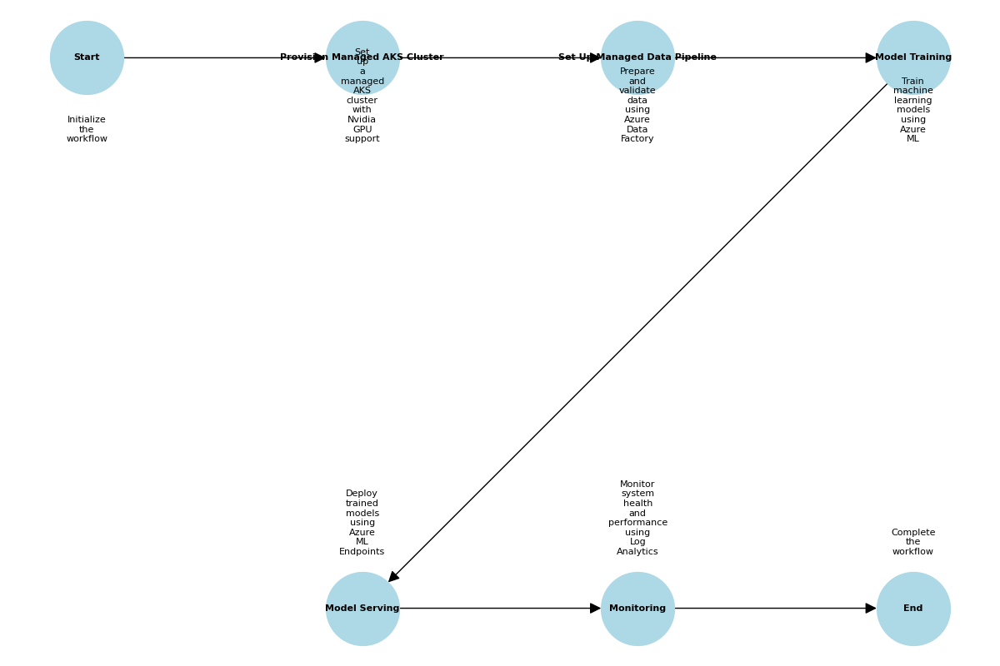

# Version 2: SaaS-Like Supported Platforms and Solutions

This folder contains Bicep templates and related files for deploying an end-to-end ML and LLM platform using managed services for simplicity and scalability. Each file corresponds to a specific component of the platform.

## Overview

Version 2 leverages managed services to simplify the deployment and management of ML and LLM platforms. It provides scalability and ease of use by utilizing Azure's managed solutions for infrastructure, data processing, model development, serving, and monitoring.

## Files and Their Purpose

1. **create_workflow_diagram.ipynb**
   - A Jupyter Notebook to visualize the workflow diagram for Version 2.

2. **gpu_vm.bicep**
   - Provisions a managed AKS cluster with Nvidia GPU support for infrastructure and orchestration.

3. **data_pipeline.bicep**
   - Sets up Azure Data Factory for managed data preparation and validation.

4. **model_training.bicep**
   - Creates an Azure Machine Learning workspace and GPU-enabled compute cluster for managed model development.

5. **model_serving.bicep**
   - Deploys a managed Azure ML Endpoint for model serving and inference.

6. **monitoring.bicep**
   - Configures a Log Analytics workspace for managed monitoring and observability.

7. **workflow_diagram_adjusted_annotations.png**
   - A visual representation of the workflow for Version 2.

## Workflow Diagram

The workflow diagram provides a visual representation of the steps involved in deploying and managing the ML and LLM platform in Version 2. It illustrates the sequence of operations and their relationships, helping users understand the overall process.



### Steps in the Workflow

1. **Start**: The workflow begins with initializing the deployment process.
2. **Provision Managed AKS Cluster**: Set up a managed AKS cluster with Nvidia GPU support for infrastructure and orchestration.
3. **Set Up Managed Data Pipeline**: Prepare and validate data using Azure Data Factory.
4. **Model Training**: Train machine learning models using GPU resources in an Azure Machine Learning workspace.
5. **Model Serving**: Deploy trained models for inference using Azure ML Endpoints.
6. **Monitoring**: Monitor model performance and system health using Azure Monitor and Log Analytics.
7. **End**: The workflow concludes after all components are deployed and operational.

The diagram file `workflow_diagram_adjusted_annotations.png` is located in this folder and can be used as a reference for understanding the deployment process.

## How to Use These Files

1. **Prerequisites**:
   - Ensure you have the Azure CLI installed and authenticated.
   - Install the Bicep CLI or use Azure CLI with Bicep support.

2. **Deployment Steps**:
   - Navigate to the `version2` folder.
   - Deploy each Bicep file using the following command:
     ```bash
     az deployment group create --resource-group <RESOURCE_GROUP> --template-file <FILE_NAME>
     ```
   - Replace `<RESOURCE_GROUP>` with your Azure resource group name and `<FILE_NAME>` with the name of the Bicep file.

3. **Order of Deployment**:
   - Deploy `gpu_vm.bicep` first to set up the infrastructure.
   - Deploy `data_pipeline.bicep` for data preparation.
   - Deploy `model_training.bicep` for model development.
   - Deploy `model_serving.bicep` for model serving.
   - Deploy `monitoring.bicep` for monitoring and observability.

## Additional Information

- **Security**: All templates follow Azure best practices for security, including encryption and role-based access control (RBAC).
- **Customization**: Modify the parameters in each Bicep file to suit your specific requirements.
- **Support**: For issues or questions, refer to the main repository's documentation or contact the maintainer.

## Known Issues

1. **data_pipeline.bicep**:
   - The resource type `Microsoft.DataFactory/factories@2022-09-01` does not have types available for validation in Bicep. Ensure all properties are correctly defined before deployment.

2. **model_training.bicep**:
   - The resource types `Microsoft.MachineLearningServices/workspaces@2022-09-01` and `Microsoft.MachineLearningServices/workspaces/computes@2022-09-01` do not have types available for validation in Bicep. Ensure all properties are correctly defined before deployment.

3. **model_serving.bicep**:
   - The resource type `Microsoft.MachineLearningServices/workspaces/onlineEndpoints@2022-09-01` does not have types available for validation in Bicep. Ensure all properties are correctly defined before deployment.

4. **monitoring.bicep**:
   - The resource type `Microsoft.OperationalInsights/workspaces@2022-09-01` does not have types available for validation in Bicep. Ensure all properties are correctly defined before deployment.

## License

This project is licensed under the MIT License. See the LICENSE file for details.