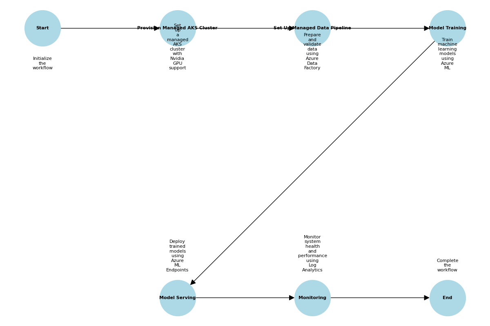

# Version 3: Open Source for Portability Across All Hyperscalers

This folder contains the implementation of Version 3, which focuses on using open-source tools and frameworks to ensure portability across all hyperscalers. The components are designed to be vendor-agnostic, leveraging open-source technologies for infrastructure, data processing, model development, serving, and monitoring.

## Overview

Version 3 emphasizes portability and flexibility by leveraging open-source tools and frameworks. It is designed to work seamlessly across different cloud providers, ensuring that organizations are not locked into a single vendor.

## Files and Their Purpose

1. **Infrastructure**
   - **`provision_vms.sh`**: Provisions virtual machines using open-source virtualization tools like KVM or Xen. Includes Kubernetes setup for orchestration.

2. **Data Pipeline**
   - **`data_preparation.py`**: Handles data cleansing, augmentation, and synthetic data generation using tools like Dask and Albumentations.
   - **`data_validation.py`**: Validates datasets using Great Expectations for schema validation and data integrity.

3. **Model Training**
   - **`train_model.py`**: Trains machine learning models using frameworks like PyTorch and TensorFlow. Includes mixed precision training for performance optimization.

4. **Model Serving**
   - **`serve_model.py`**: Deploys models for inference using Triton Inference Server and FastAPI. Supports multi-model serving.

5. **Guardrails**
   - **`pii_detection/presidio_config.yaml`**: Configures Presidio for PII detection and redaction.
   - **`prompt_protection/guardrailsai_config.yaml`**: Configures Guardrails AI for prompt protection.

6. **LLMOps**
   - **`evaluation/trulens_eval.py`**: Evaluates models using TruLens with tracking logging for evaluation metrics.
   - **`prompt_logs/promptlayer_integration.py`**: Logs prompts and responses using PromptLayer for observability.

7. **Monitoring**
   - **Prometheus and Grafana**: Integrated for real-time monitoring.
   - **Kubecost**: Provides cost management insights.

## Workflow Diagram

The workflow diagram provides a visual representation of the steps involved in deploying and managing the ML and LLM platform in Version 3. It illustrates the sequence of operations and their relationships, helping users understand the overall process.

### Steps in the Workflow

1. **Start**: The workflow begins with initializing the deployment process.
2. **Provision VMs with GPU Acceleration**: Set up virtual machines with GPU support and Kubernetes for infrastructure and orchestration.
3. **Set Up Data Pipeline**: Prepare, validate, and augment data using open-source tools like Great Expectations and Albumentations.
4. **Model Training**: Train machine learning models using open-source frameworks such as PyTorch and TensorFlow.
5. **Model Serving**: Deploy trained models for inference using Triton Inference Server.
6. **Monitoring**: Monitor system health and costs using Prometheus, Grafana, and Kubecost.
7. **End**: The workflow concludes after all components are deployed and operational.

The diagram file `workflow_diagram_adjusted_annotations.png` is located in this folder and can be used as a reference for understanding the deployment process.

## How to Use These Files

1. **Prerequisites**:
   - Ensure you have the necessary dependencies installed (e.g., Python packages, Docker, Kubernetes).
   - Install required tools like Dask, Great Expectations, and Triton Inference Server.

2. **Deployment Steps**:
   - Run `provision_vms.sh` to set up the infrastructure.
   - Use `data_preparation.py` and `data_validation.py` for data pipeline setup.
   - Train models using `train_model.py`.
   - Deploy models using `serve_model.py`.
   - Set up monitoring tools like Prometheus and Grafana.

3. **Order of Execution**:
   - Start with infrastructure setup.
   - Proceed to data pipeline configuration.
   - Train and deploy models.
   - Configure monitoring and observability.

## Additional Information

- **Security**: Includes configurations for PII detection and prompt protection.
- **Customization**: Modify the scripts and configurations to suit your specific requirements.
- **Support**: For issues or questions, refer to the main repository's documentation or contact the maintainer.

## Known Issues

1. **Infrastructure Setup**:
   - Ensure the host machine supports virtualization and has sufficient resources for VM provisioning.

2. **Data Pipeline**:
   - Large datasets may cause memory issues during data preparation or validation. Consider using distributed processing frameworks like Apache Spark.

3. **Model Training**:
   - GPU acceleration requires compatible hardware and drivers (e.g., Nvidia CUDA).

4. **Model Serving**:
   - Ensure the trained model file exists before running the serving script.

5. **Monitoring**:
   - Verify that monitoring tools are correctly configured and accessible.

## Suggested Improvements for Code Files

### Infrastructure
- **`provision_vms.sh`**:
  - Add error handling for failed installations.
  - Automate network configuration for Kubernetes.

### Data Pipeline
- **`data_preparation.py`**:
  - Add support for more augmentation techniques.
  - Optimize synthetic data generation for large datasets.

- **`data_validation.py`**:
  - Add more comprehensive validation rules.
  - Integrate with a data catalog for automated schema updates.

### Model Training
- **`train_model.py`**:
  - Add support for distributed training.
  - Implement model checkpointing and early stopping.

### Model Serving
- **`serve_model.py`**:
  - Add authentication and rate limiting for API endpoints.
  - Integrate with a model registry for version control.

### Monitoring
- **Prometheus and Grafana**:
  - Add custom dashboards for specific metrics.
  - Include alerts for critical system events.

## License

This project is licensed under the MIT License. See the LICENSE file for details.